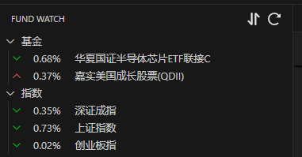
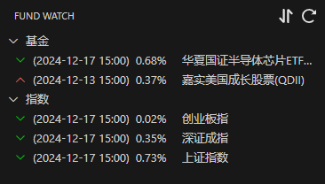

# vscode 基金插件

* 由于原项目不支持QDII型基金，故修改数据源二创（本插件不能与FUND-WATCH插件共存）
* fund-watch.interval: 刷新频率，单位秒，默认 2

* fund-watch.favoriteFunds: 自选基金列表，值为基金代码

* fund-watch.showUpdateTime: 基金数据更新时间，默认不显示，1:显示年-月-日，2:显示年-月-日 时:分

```json
{
    "fund-watch.favoriteFunds": [
      "000043",
      "008888"
    ],
    "fund-watch.favoriteIndexs": [
      "000043",
      "008888"
    ],
    "fund-watch.interval": 2,
    "fund-watch.showUpdateTime": 0,
}
```
* 默认显示


* 显示年月日


## 原项目仓库 [FUND-WATCH](https://github.com/Shenfq/fund-watch.git)